# AppleSignInDemo
## Using Sign in with Apple to authenticate users

This demo shows how to use the new Sign in with Apple to authenticate users.

Note that for this demo you’ll need an actual device running iOS 13. 
Sign in with Apple doesn’t work correctly in the simulator.


___

## Overview
Sign in with Apple is a new service introduced with iOS 13 that allows users to sign into your app or website using their Apple ID. The user controls what data is available to the website. For example, they can hide their real email address and have Apple create a random email relay address that forwards email from the app or website to their real email account.

## Getting Started 
Note that for this demo you’ll need:

* A real device running iOS 13. Sign in with Apple doesn’t work correctly in the simulator
* You must be signed into the device with an Apple ID that has two-factor authentication enabled

Create a new iOS single view app (UIKit and Storyboard) and name it **AppleSignInDemo**. 
Update the app’s provisioning profile to add support for the **Sign In with Apple** capability (**Target settings > Signing & Capabilities**):

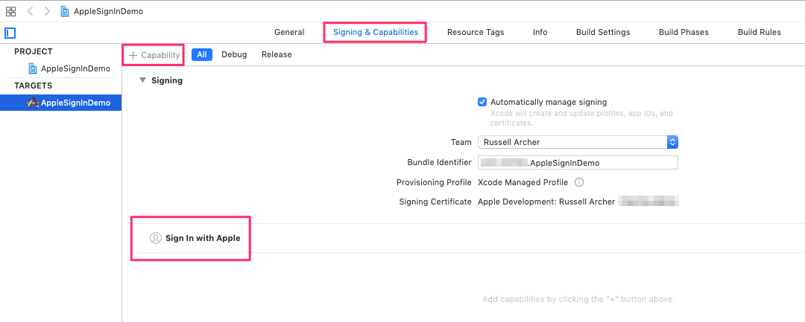

Now add the **AuthenticationServices** framework to the app in the **General** section of **Target** settings:

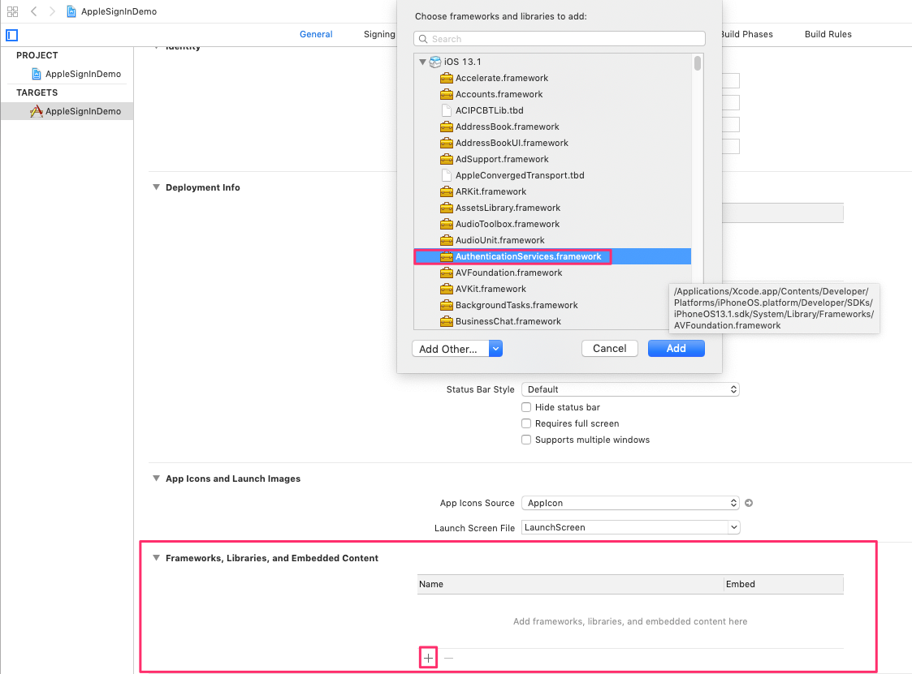
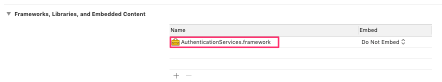

Open the storyboard, add a **StackView** to the **ViewController** and then add a **Label** to the StackView.
Now create an **Outlet** for the StackView in the ViewController:

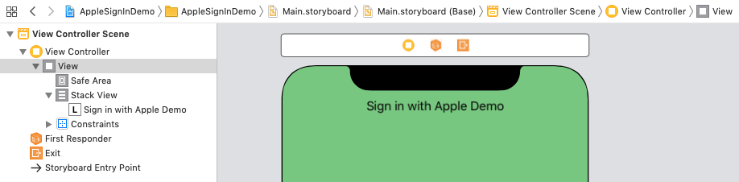

___

## Creating the Sign in with Apple button
The “Sign in with Apple” button can’t be added to the storyboard from the **Library**, so we need to add from code:

``` swift
//
//  ViewController.swift
//  AppleSignInDemo
//
//  Created by Russell Archer on 27/09/2019.
//  Copyright © 2019 Russell Archer. All rights reserved.
//

import UIKit
import AuthenticationServices

class ViewController: UIViewController {
    @IBOutlet weak var stackView: UIStackView!

    override func viewDidLoad() {
        super.viewDidLoad()

        // Create a Sign in with Apple button, set a target for the touchUpInside event and then add it to our stackview
        let signInBtn = ASAuthorizationAppleIDButton()
        signInBtn.frame.size = CGSize(width: 280, height: 60)   // 280 x 60 is the Apple recommended size
        signInBtn.addTarget(self, action: #selector(handleSignInWithApple), for: .touchUpInside)
        stackView.addArrangedSubview(signInBtn)
    }


    /// Request an authorization using Sign in with Apple
    @objc func handleSignInWithApple() {
        // TODO
    }
}
```

Running the app now produces:


___

## Add code to request authorization
We now need to add code to request an actual authorization when the sign in button’s tapped:

``` swift
class ViewController: UIViewController {
    :
    :
    
    /// Request an authorization using Sign in with Apple
    @objc func handleSignInWithApple() {
        let request = ASAuthorizationAppleIDProvider().createRequest()  // Create a request object
        request.requestedScopes = [.fullName, .email]  // Configure what info you'd like returned from the user
        
        // Create a controller object that manages the authorization request
        let authorizationController = ASAuthorizationController(authorizationRequests: [request])

        // Set ourselves as the controller's delegate (we must implement ASAuthorizationControllerDelegate protocol)
        authorizationController.delegate = self
        
        // Set ourselves as a delegate so we can tell it which window to attach the sign in window to
        // This means we must implement the ASAuthorizationControllerPresentationContextProviding protocol
        authorizationController.presentationContextProvider = self
        
        // Do the actual authorization request by presenting the sign in window.
        // Authorization succeeds: the controller calls authorizationController(controller:didCompleteWithAuthorization:)
        // Authorization fails: the system calls the authorizationController(controller:didCompleteWithError:)
        authorizationController.performRequests()
    }
}

// MARK: ASAuthorizationControllerDelegate protocol implementation

extension ViewController: ASAuthorizationControllerDelegate {
    
    /// Handles the result of an authorization request
    func authorizationController(controller: ASAuthorizationController, didCompleteWithAuthorization authorization: ASAuthorization) {
        // Get the credential returned from the authorization
        guard let appleIDCredential = authorization.credential as? ASAuthorizationAppleIDCredential else {
            print("Error getting authorization credential")
            return
        }
        
        // Here we just print out the credential returned. In a real app we'd then store the credential details
        // in a database or the keychain. Note that the appleIDCredential.user should be used as a primary key
        // when storing credential details. On subsequent authorization requests for a particular user ONLY
        // appleIDCredential.user is returned, the other credential details (name and email) are NOT returned.
        // This is because Apple assumes (because you've had a successful first sign in by the user) that
        // you've added the user's name and email to your system previously.
        print("Authorized!")
        print(appleIDCredential.user)  // Identifier associated with an authenticated user. Use as Primary Key when storing
        print(appleIDCredential.fullName?.givenName ?? "No name")
        print(appleIDCredential.email ?? "No email")
    }
    
    /// Handle error authorization errors
    func authorizationController(controller: ASAuthorizationController, didCompleteWithError error: Error) {
        print("Authorization failed: \(error.localizedDescription)")
    }
}

// MARK: ASAuthorizationControllerPresentationContextProviding protocol implementation

extension ViewController: ASAuthorizationControllerPresentationContextProviding {

    /// iOS 13 supports multiple windows so tell the authorization controller which window to use
    func presentationAnchor(for controller: ASAuthorizationController) -> ASPresentationAnchor {
        return self.view.window!  // ASPresentationAnchor is a typealias for UIWindow
    }
}
```

___

## Create a Sign in with Apple Key
Before you can use Sign in with Apple in your app you need to create a **Key** for the service in your developer account.
See https://help.apple.com/developer-account/#/devcdfbb56a3 for details.

To create the key, go to the **Certificates, Identifiers & Profiles** page and select **Keys** from the sidebar.
Click **Create** a Key:

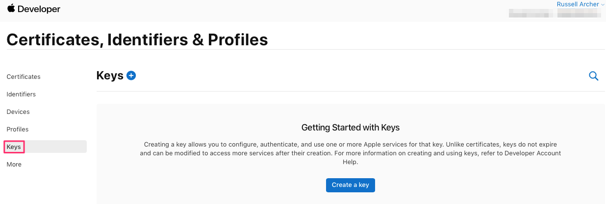

Check **Sign In with Apple**, give the key a unique (for your account) **Key Name** and click **Configure**:

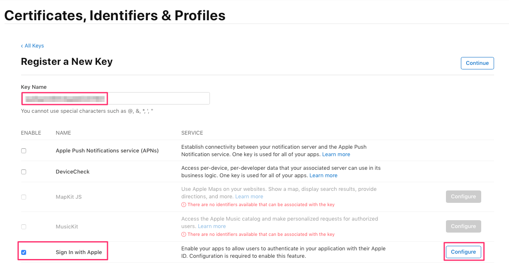

Select the App ID that will make use of the key and then click **Save**:

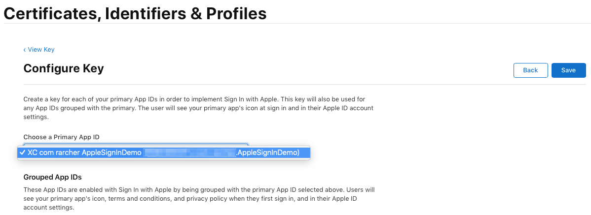

Click **Continue**:

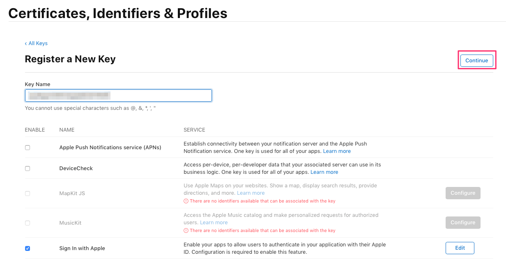

Check the details are correct then click **Register**:

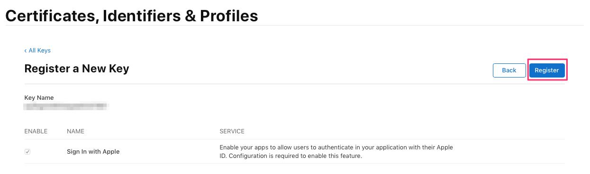

Now **download** your key and save it.

Note that for this simple demo app you don’t actually need the key (i.e. you don’t need to add it to the app in any way). 
However, for more complex scenarios (e.g. if you want to extend sign in support to a web site associated with your app) you may 
need the key in future, so it’s good practice to download it.

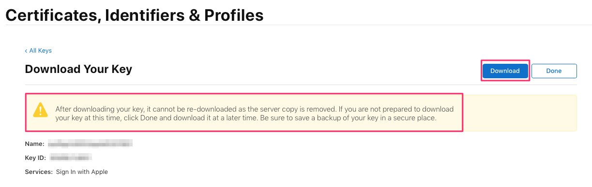

Once the key has downloaded you can examine it. It’s just a text file with a *.p8* extension:

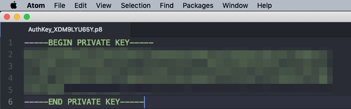

You now see a key a has been created:

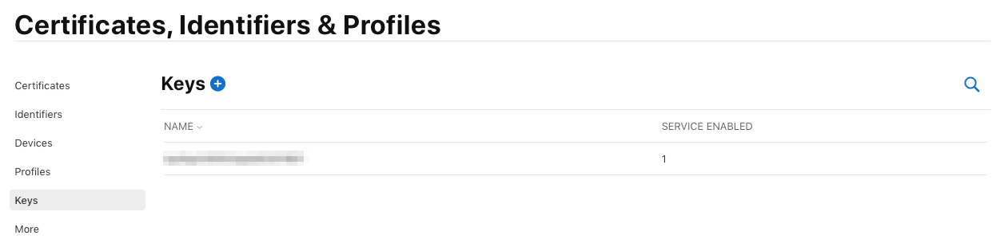

___

## Test the app
If you now run the app on a (real) test device without being signed-in with an Apple ID you’ll see:

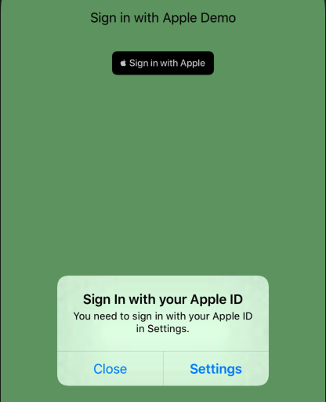

Once you’ve logged in with an Apple ID you’ll get another error if your account doesn’t have two-factor authentication (2FA) turned on:

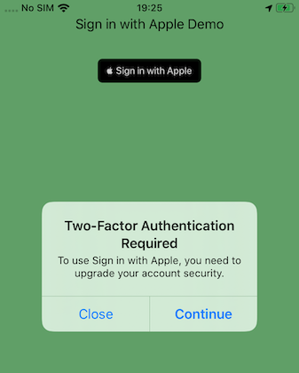

Once you are signed-in with an Apple ID with 2FA turned on you should see the following:

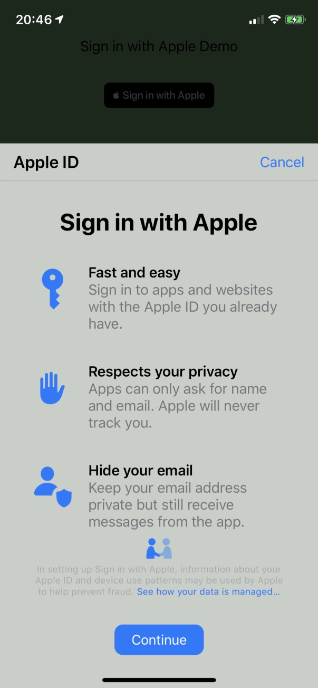

After tapping **Continue** you see:

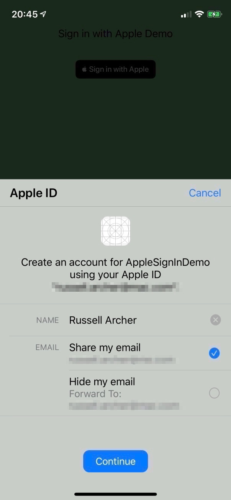

As you can see, the user can control what details they share with the app.
The user can even hide their real email from the app:

Quote from Apple Support document (https://support.apple.com/en-gb/HT210425):

> A unique, random email address is created, so your personal email address isn't shared with the app or website developer 
> during the account setup and sign in process. This address is unique to you and the developer and follows this format: 
> <unique-alphanumeric-string>@privaterelay.appleid.com
> 
> For example, if j.appleseed@icloud.com is your Apple ID, your unique, random email address for a given app might look 
> like dpdcnf87nu@privaterelay.appleid.com. Any messages sent to this address by the app or website developer are automatically 
> forwarded to your personal email address by our private email relay service. You can read and respond directly to these 
> emails and still keep your personal address private.

Once you’ve chosen what details to share with the app you tap **Continue** and then authenticate using Face ID, Touch ID, etc.
Assuming you correctly authenticate you should see the following in the console the **first time** you successfully authenticate:

```
Authorized!
<Apple ID Credential User>e.g. 001664.3aa027ba9878489ca624ee2020936ff8.1946
<Your name> 
<Your real email or Apple relay email address>
```

On subsequent sign in attempts you’ll see:

```
Authorized!
001664.3aa027ba9878489ca624ee2020936ff8.1946
No name
No email
```

___

## Save the User Identifier for re-authentication
To finish our demo app we can add some code to check for a valid Apple ID credential before a “secure task” is performed.
To do this, we’ll save the user identifier when the user successfully authenticates, and then check with an **ASAuthorizationAppleIDProvider** 
object that the credential is still valid. Apple recommends this is done because at any time a user can sign out of their Apple ID.

First, add a **Perform Secure Task** button to the storyboard and create an action for it in **ViewController**:

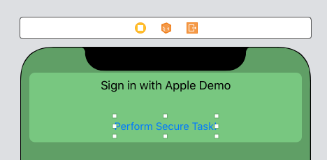

Here’s the updated ViewController code:

``` swift
class ViewController: UIViewController {
    @IBOutlet weak var stackView: UIStackView!
    
    fileprivate var userIdentifier: String?  // Used to save the id of an authenticated user
    
    :
    :
    
    @IBAction func performSecureTaskTapped(_ sender: Any) {
        guard userIdentifier != nil else { return }
        
        let provider = ASAuthorizationAppleIDProvider()
        
        // See if there is valid crential for the user.
        // Apple recommends this is done before performing any task that relies on the user being
        // signed-in with an Apple ID. This is because at any time a user can sign out
        
        provider.getCredentialState(forUserID: userIdentifier!) { (credentialState, error) in

            switch credentialState {
                case .authorized:
                    print("Apple ID credential is valid and authorized! OK to perform secure task :-)")
                    break
                case .revoked: fallthrough
                case .notFound:
                    self.userIdentifier = nil
                    print("Apple ID credential not found. Need to re-authenticate")
                    break
                default: break
            }
        }
    }
}

// MARK: ASAuthorizationControllerDelegate protocol implementation
extension ViewController: ASAuthorizationControllerDelegate {
    
    /// Handles the result of an authorization request
    func authorizationController(controller: ASAuthorizationController, didCompleteWithAuthorization authorization: ASAuthorization) {
        :
        :
        
        userIdentifier = appleIDCredential.user  // Save the user id
    }
}
```
